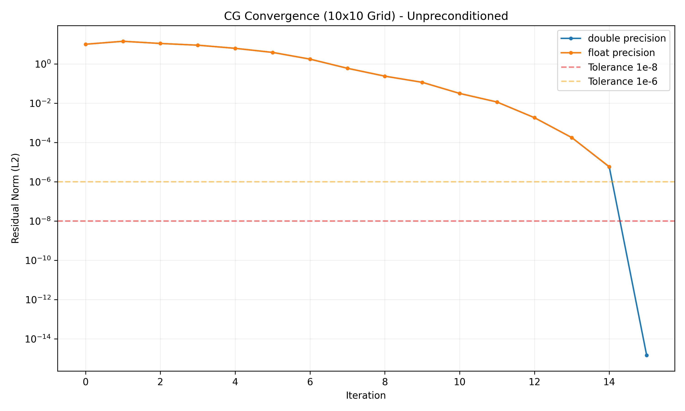
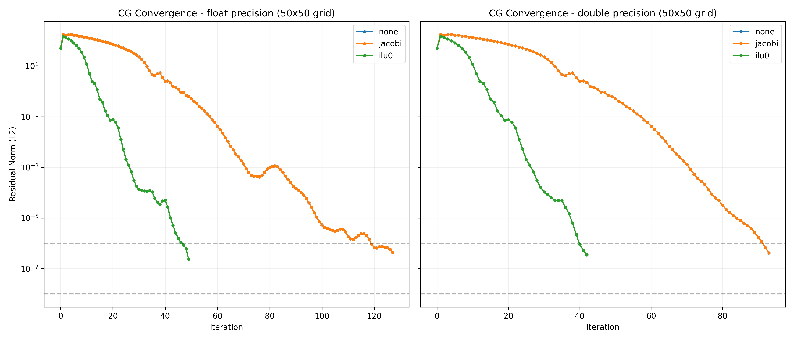
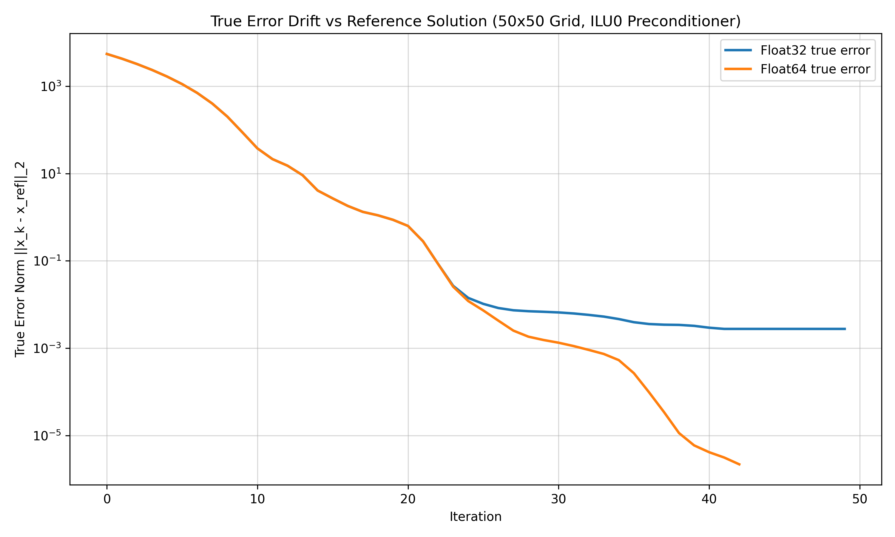
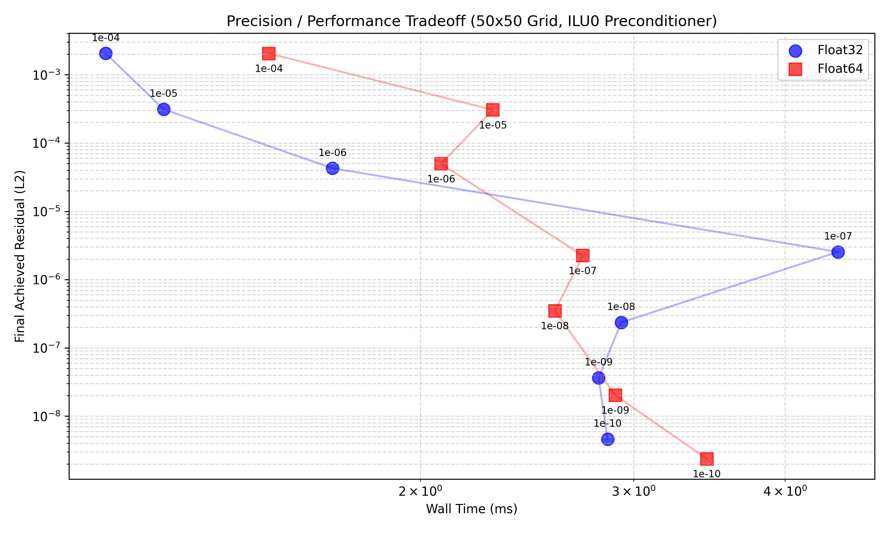

# CG Precision HPC: An Empirical Study of Floating-Point Error in Sparse Iterative Solvers

## Motivation & Scientific Context

This project investigates the numerical stability, error propagation, and performance tradeoffs of the Conjugate Gradient (CG) method applied to sparse linear systems—specifically the 2D Laplacian (Poisson equation on a discrete grid). 

In modern High-Performance Computing (HPC), there is a constant push to maximize throughput and minimize memory bandwidth. Two primary avenues to achieve this are **parallel preconditioners** (which reduce required iterations but shift the mathematical behavior of the solver) and **mixed or reduced-precision arithmetic** (which halves memory traffic but introduces roundoff error). 

However, reducing precision in iterative solvers is not a zero-cost optimization. As operations accumulate, floating-point error drifts away from the true mathematical trajectory. This project provides an empirical foundation to observe *exactly when and how* this precision breakdown occurs. The analysis directly aligns with research into stochastic arithmetic for floating-point error tracking (such as the [Verificarlo](https://github.com/verificarlo/verificarlo) toolchain) and informs the theoretical bounds of domain decomposition and preconditioner research in numerical linear algebra.


## Project Structure

The repository is built from scratch in C++17 with no external solver libraries. The CG solver and sparse matrix formats are implemented manually to expose internal state for iteration-by-iteration analysis.

```text
cg-precision-hpc/
│
├── CMakeLists.txt        Build configuration
├── README.md             This documentation
│
├── src/                  
│   ├── csr_matrix.hpp    Compressed Sparse Row storage and SpMV kernel
│   ├── laplacian.hpp     2D Poisson stencil assembly (5-point)
│   ├── preconditioners.hpp Jacobi (diagonal) and ILU(0) implementations
│   ├── cg_solver.hpp     PCG algorithm with exact error drift tracking
│   └── main.cpp          CLI driver for convergence, drift, and tradeoff analysis
│
├── scripts/              Visualization scripts (matplotlib)
│   ├── plot_convergence.py
│   ├── plot_preconditioners.py
│   ├── plot_drift.py
│   └── plot_tradeoff.py
│
├── data/                 Generated CSV outputs
└── plots/                Generated visualization plots
```


## Technical Results & Analysis

The solver was evaluated on a $50 \times 50$ grid ($N = 2500$ unknowns). All plots below are generated directly from the C++ binary outputs via the provided Python scripts.

### 1. The Precision Floor (Initial Convergence)


**Observation:** When solving the system without preconditioning, the Float32 (`float`) implementation stagnates entirely near an L2 residual norm of $10^{-5}$, whereas the Float64 (`double`) implementation cleanly resolves the system down to machine epsilon ($10^{-15}$). 

**Analysis:** The stagnation in Float32 is a classic representation of the loss of orthogonality in the Conjugate Gradient Krylov subspace. CG relies on residual vectors $r_k$ remaining orthogonal to previous search directions. As floating-point truncation accumulates during the Sparse Matrix-Vector product (SpMV) `A * p` and the heavy dot products `(r, r)` at each step, this mathematical property is violated, causing the solver to "wander" without making further progress toward the exact solution.

### 2. Preconditioner Impact on Error


**Observation:** Incomplete LU factorization with zero fill-in, `ILU(0)`, severely compresses the required iteration count compared to Jacobi (diagonal scaling) and the baseline unpreconditioned solver. 

**Analysis:** Preconditioners are primarily used to reduce iteration steps by decreasing the condition number $\kappa(A)$ of the matrix. However, an often-overlooked secondary benefit is **error mitigation**. Because ILU(0) solves the system in 50 iterations instead of >2000, there are drastically fewer SpMV operations and dot products. This mathematically prevents the massive accumulation of roundoff error that plagued the longer-running unpreconditioned Float32 solver.

### 3. Tracking The True Error Drift


**Observation:** This plot tracks the *true error* $||x_k - x_{\text{ref}}||_2$ where $x_{\text{ref}}$ is a high-precision reference answer computed in Float64 with a $10^{-12}$ tolerance. The divergence point is striking.

**Detailed Analysis of the CSV Data:**
Looking directly at the `drift_comparison_50.csv` data (general form: `drift_comparison_<grid>.csv`):
* **Iteration 0-25:** Both `float` and `double` track perfectly together. At iteration 25, `float` true error is `1.03e-02` and `double` true error is `7.31e-03`.
* **Iteration 35:** The divergence becomes massive. `double` hits `2.67e-04` while `float` lags at `3.93e-03` (an order of magnitude worse).
* **Iteration 42-49:** The `double` precision solver terminates as it reaches its target tolerance, with a final true error of `2.19e-06`. The `float` solver, however, completely flatlines. From iteration 43 through 49, its true error locks identically at `2.764262e-03`. 

This flatline proves that the Float32 solver is no longer physically capable of updating the solution vector $x_k$ because the computed alpha step size $\alpha_k p_k$ has become smaller than the unit in the last place (ULP) of the current solution vector integers, resulting in complete arithmetic absorption.

### 4. The Pareto Boundary of Precision


**Observation:** A Pareto efficiency tradeoff curve mapping wall-clock execution time against the final achievable residual for varying target tolerances ($10^{-4}$ to $10^{-10}$).

**Detailed Analysis of Tradeoff Data:**
* For loose target tolerances like $10^{-4}$ and $10^{-5}$, **both precisions require exactly the same number of iterations** (25 and 28 respectively). Here, Float32 is computationally superior, as it requires less memory bandwidth and fewer clock cycles per floating-point operation.
* As the requested tolerance tightens to $10^{-8}$, Float64 requires 42 iterations while Float32 struggles, requiring 49 iterations to hit the same threshold, entirely negating the execution speed advantage of 32-bit math.
* At $10^{-10}$, Float32 requires 58 iterations. It takes **longer in absolute wall-clock time** than Float64 (which only requires 51 iterations) and still produces a final residual that is 20 times less accurate ($4.62 \times 10^{-9}$ vs $2.37 \times 10^{-9}$).


## Scientific Conclusions

1. **The Cost of Low Precision:** Lower precision (Float32) introduces an absolute theoretical floor on achievable residual. Iterating past this floor does not improve accuracy; it only wastes compute cycles due to the loss of Krylov subspace orthogonality.
2. **Preconditioning as Error Mitigation:** Effective preconditioners like ILU(0) don't just solve problems faster; by drastically reducing iteration counts, they mathematically prevent the deep accumulation of floating-point truncation errors, making lower-precision formats viable for harder problems.
3. **The Efficiency Crossover:** The tradeoff analysis proves that mixed-precision approaches are strictly optimal. Float32 should be used for initial transient smoothing (e.g., in a multigrid solver or the first steps of a Newton-Krylov solver), but Float64 becomes mandatory when strict convergence tolerances (`< 1e-6`) are required.


## Build and Run

### Prerequisites
* CMake 3.14+
* C++17 compliant compiler
* Python 3.9+ with:
	* `pandas>=1.5`
	* `matplotlib>=3.7`

Install Python dependencies:
```bash
python -m pip install pandas matplotlib
```

### Compilation
```bash
cmake -B build -DCMAKE_BUILD_TYPE=Release
cmake --build build --config Release
```

### CLI Usage
Use:
```bash
./build/Release/cg_solver.exe --help
```

Supported options:
* `--grid-size <int>`: grid edge length `n` for an `n x n` system.
* `--tol <float>`: relative residual tolerance.
* `--max-iter <int>`: iteration cap.
* `--precision <float|double>`: arithmetic precision.
* `--precon <none|jacobi|ilu0>`: preconditioner choice.
* `--track-drift`: run drift mode (writes `data/drift_comparison_<grid>.csv`).
* `--tradeoff-sweep`: run sweep mode (writes `data/tradeoff_<grid>.csv`).

Notes:
* `--track-drift` and `--tradeoff-sweep` ignore `--precision` and `--precon`.
* Convergence mode writes `data/convergence_<precision>_<precon>_<grid>.csv`.

### Windows Quick Start
```powershell
cmake -B build -DCMAKE_BUILD_TYPE=Release
cmake --build build --config Release
./build/Release/cg_solver.exe --help
```

### Reproducing the Analysis

The executable `cg_solver.exe` generated all data used in this README.

**1. Initial Convergence Figure (`plots/convergence_initial.png`)**
```bash
./build/Release/cg_solver.exe --grid-size 10 --tol 1e-8 --max-iter 2000 --precision float --precon none
./build/Release/cg_solver.exe --grid-size 10 --tol 1e-8 --max-iter 2000 --precision double --precon none
python scripts/plot_convergence.py --grid 10 --precon none
```

**2. Preconditioner Figure (`plots/convergence_preconditioners.png`)**
```bash
./build/Release/cg_solver.exe --grid-size 50 --tol 1e-8 --max-iter 2000 --precision float --precon none
./build/Release/cg_solver.exe --grid-size 50 --tol 1e-8 --max-iter 2000 --precision float --precon jacobi
./build/Release/cg_solver.exe --grid-size 50 --tol 1e-8 --max-iter 2000 --precision float --precon ilu0
./build/Release/cg_solver.exe --grid-size 50 --tol 1e-8 --max-iter 2000 --precision double --precon none
./build/Release/cg_solver.exe --grid-size 50 --tol 1e-8 --max-iter 2000 --precision double --precon jacobi
./build/Release/cg_solver.exe --grid-size 50 --tol 1e-8 --max-iter 2000 --precision double --precon ilu0
python scripts/plot_preconditioners.py --grid 50
```

**3. Precision Drift Figure (`plots/precision_drift.png`)**
```bash
./build/Release/cg_solver.exe --grid-size 50 --max-iter 3000 --track-drift
python scripts/plot_drift.py --grid 50
```

**4. Precision/Performance Figure (`plots/tradeoff_curve.png`)**
```bash
./build/Release/cg_solver.exe --grid-size 50 --max-iter 3000 --tradeoff-sweep
python scripts/plot_tradeoff.py --grid 50
```

## Compact Results Snapshot (50x50, ILU0)

| Target Tol | Float Iter | Double Iter | Float Final Residual | Double Final Residual |
|-----------:|-----------:|------------:|---------------------:|----------------------:|
| 1e-4       | 25         | 25          | 2.048e-03            | 2.047e-03             |
| 1e-8       | 49         | 42          | 2.354e-07            | 3.489e-07             |
| 1e-10      | 58         | 51          | 4.624e-09            | 2.373e-09             |

Source: `data/tradeoff_50.csv`.

## Timing Caveats

* Wall times are machine- and load-dependent.
* Values shown are single-run measurements, not averaged over repeated trials.
* Use iteration count and residual trends as the more stable cross-machine comparison metric.

## Limitations

* Current implementation is CPU-serial and does not use threaded SpMV or BLAS backends.
* ILU(0) is implemented directly in CSR and intended for controlled experiments, not production-optimized sparse kernels.
* Only the 2D 5-point Laplacian benchmark is included in this repository.
